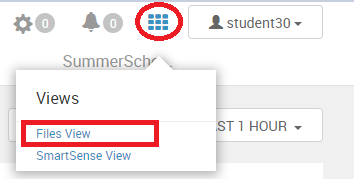
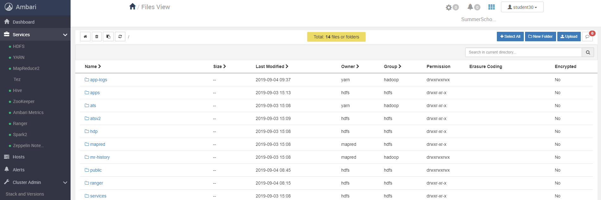

# Working with files in Hadoop Distributed File System (HDFS)

## Hints for working with HDFS
* You can use either absolute paths in HDFS, like `/user/studentX/data` or use relative paths to your *user* directory in HDFS, like just `data`. So, if you want to work with data that is stored outside your HDFS *user* directory, you have to use absolute paths.
* Don't mix up the HDFS home directory `/user/studentX` with your user home directory on local disk `/home/studentX`!
* For using many of the well-known file system commands (like mkdir, ls, chmod, chown, cat, etc.) in HDFS, just add the prefix `hdfs dfs -<command>` to the command, e.g. `hdfs dfs -ls /` to show the content of the HDFS root directory.
* For help about available HDFS commands, just type `hdfs dfs` in your console (on a SSH session).

## Uploading files to HDFS (used in exercises later)
1. Open (or re-use) a SSH session that connects to the NameNode of the Hadoop cluster:  
use `PuTTY` tool or do `ssh studentX@<ip of hadoop namenode>` in Terminal
2. Running the following command to check HDFS connectivity:  
`hdfs dfs -ls /`
3. Creating a *data* directory in your HDFS home directory:  
`hdfs dfs -mkdir /user/studentX/data` (or with relative path `hdfs dfs -mkdir data`)
4. Upload the MovieLens directory (containing *tags* and *movies* sub-dirs) into the *data* folder:  
`hdfs dfs -put /opt/data/movielens data`
5. Copy the MovieLens *ratings* and *links* directory from *public* directory to *data*  
`hdfs dfs -cp /public/movielens/* data/movielens`
6. Upload a zip file to HDFS, by first unzipping it and uploading the output:  
`gunzip -c /opt/data/access_log.gz | hdfs dfs -put - data/access_log`
7. Rename files in HDFS:  
`hdfs dfs -mv data/access_log data/logfile`
8. Check the structure of your HDFS *user* directory (should contain the *data* directory):  
`hdfs dfs -ls`
9. Check the *data* directory (should contain the *movielens* directory and the *logfile* file):  
`hdfs dfs -ls data`
10. Check the *movielens* directory (should contain README.txt and 4 sub-folders):  
`hdfs dfs -ls data/movielens`
11. Delete the *README.txt* file from *movielens* in HDFS **without putting it into HDFS trash**:  
`hdfs dfs -rm -skipTrash data/movielens/README.txt`
12. Delete the *links* directory:  
`hdfs dfs -rm -r data/movielens/links`
13. Final check for the *data/movielens* directory in your HDFS user home (folders *movies*, *ratings* and *tags*):  
`hdfs dfs -ls data/movielens`

## Showing the content of a file stored in HDFS
1. Show the last 50 lines of the *data/logfile* file:  
`hdfs dfs -cat data/logfile | tail -n 50`

## Downloading files from HDFS to loal disc
1. Download the *data/logfile* file to a directory on local disk, e.g. into your user home:  
`hdfs dfs -get data/logfile ~/logfile.log`
2. Check the download, e.g. by showing first 50 rows of the **local file**:  
`head -n 50 ~/logfile.log`

## Using the Ambari Files View
The Ambari Server provides also an UI for viewing and managing the files in HDFS. Based on your logged in user, you see the directories you are allowed to see (and edit). To use the Ambari Files View, log in to the Ambari UI (Port 8080 on your Hadoop NameNode), then click on the blue grid in the upper right corner (to the left to your username). A sub-menu opens where you can click on **Files View**.  

The Files View opens inside the Ambari UI.  

Try to find the uploaded data in your user home directory (**/user** path).  

**Remember:** This view only shows the content of the HDFS partitions. Don't confuse it with the local system partition.
