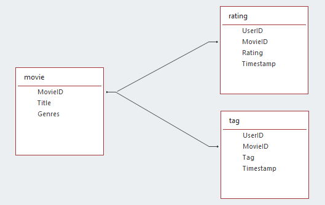

# Examining MovieLens dataset with Apache Hive

## About the MovieLens dataset




## Preparation
1. Open (or re-use) a SSH session that connects to the NameNode of the Hadoop cluster:  
`ssh studentX@<ip of hadoop namenode>`
2. Run the Beeline tool (command line iterface for working with Hive):  
`beeline` (enter your username *studentX* when asked, and leave password empty)

## Create a new database and add the tables
In Beeline run the following commands - don't forget to end your queries with a semicolon! The default storage format for Hive is ORC (Optimized Row Columnar), more infos here: https://cwiki.apache.org/confluence/display/Hive/LanguageManual+ORC

1. Create a new database for your user:  
`create database movielensX;` (where X is the id of your username)
2. Switch to this database:  
`use movielensX;`
3. Create the *tags* table:  
`create table tags (userid int, movieid int, tag string, ts bigint);`
4. Create the *ratings* table:  
`create table ratings (userid int, movieid int, rating float, ts bigint);`
5. Create the *movies* table:  
`create table movies (movieid int, title string, genres array<string>);`

## Fill tables by using external tables
As an alternative to the internal tables (like created above), Hive knows so-called external tables. External tables can be regarded as references to existing data in the HDFS. This reference can be used, for example, to query structured data that has already been stored using SQL-like syntax (HiveQL). 

External tables are mostly used for the query/processing of text-based, readable files. External tables can also be used to fill ORC-based tables from such text-based tables (and thus bring the data into the memory-optimized ORC format).

### As an example, this section shows the process to bring structured, text-based data (like CSV file) into the optimized ORC format.
1. Create an external table, that references the corresponding HDFS directory (same columns as used above for the internal table):  
**Important:** Replace studentX in the location property with your user name!  
**Hint:** Copy this statement into an Text editor and copy it from there into the Beeline console
```
create external table tags_ext (
  userid int, 
  movieid int, 
  tag string, 
  ts bigint) 
row format delimited 
fields terminated by ',' 
stored as textfile 
location '/user/studentX/data/movielens/tags/' 
tblproperties("skip.header.line.count"="1");
```

2. Now you can check, if you can access the data in your *tags* directory by using HiveQL:  
```
select * from tags_ext limit 1;
```

3. Fill the ORC-based (internal) table by querying the external table. This will start a Tez job, that transfers the data from text-based format into the ORC format:  
```
insert into tags select * from tags_ext;
```

4. Check also, if the data was written into the ORC table *tags*:  
```
select * from tags limit 1;
```

5. **Exercise:** Repeat step 1 to 4 for the *ratings* tables, BUT **not** for the *movies* table.  
**Hint:** You can view the first rows of the *ratings.csv* file in HDFS (to see the structure of the file) by runnning  
`hdfs dfs -cat data/movielens/ratings/ratings.csv | head -n 2` (run the command outside beeline)  
<details>
  <summary>Open solution for ratings</summary>
  
  ```
  create external table ratings_ext (
    userid int, 
    movieid int, 
    rating float, 
    ts bigint)
  row format delimited 
  fields terminated by ',' 
  stored as textfile 
  location '/user/studentX/data/movielens/ratings/' 
  tblproperties("skip.header.line.count"="1");
  ```
  ```
  select * from ratings_ext limit 1;
  ```
  ```
  insert into ratings select * from ratings_ext; 
  ```
  ```
  select * from ratings limit 1;
  ```
</details>

### Using Apache Spark to write the *movies* table
As an alternative to using HiveQL (like we did above), Apache Spark can also be used to write (or read) data to (from) Hive. In Hadoop 3, the so-called "Hive Warehouse Connector" must be used to make the Hive memory visible to Spark. 

This example reads the corresponding files from HDFS, transforms it (bringing a column into correct format) and saves it to a Hive table using Spark SQL.
1. In a SSH session, run the *spark-shell* command to start the interactive Spark shell (there's also a Python shell, but we will work with Scala here)  
**Important:** Use the *--jars* parameter to add the Hive Warehouse Connector (HWC) dependency to be able to connect to Hive from Spark  
**Important:** Use the *--conf* parameter to give Spark the connection URL (JDBC) for your Hive database, don't forget to add also the *user* property to the URL (replace the *X* with the id in your username)  
**Hint:** Don't use <Ctl + C> in the Spark Shell, it will terminate the Session!  
```
spark-shell --jars /usr/hdp/current/hive_warehouse_connector/hive-warehouse-connector-assembly-1.0.0.3.1.0.0-78.jar --conf spark.sql.hive.hiveserver2.jdbc.url="jdbc:hive2://localhost:2181/;serviceDiscoveryMode=zooKeeper;zooKeeperNamespace=hiveserver2;user=studentX" --conf spark.executor.memory=640m --conf spark.driver.memory=640m
```

2. Import the Hive Warehouse Connector and start a session (needed to be able to access Hive tables):
```
import com.hortonworks.hwc.HiveWarehouseSession
val hive = HiveWarehouseSession.session(spark).build()
```

3. Use Spark SQL to read a CSV file as Dataset into the Spark session
```
val read = spark.read.format("csv").option("header", "true").option("delimiter", ",").load("/user/studentX/data/movielens/movies/movies.csv")
```

4. The *movies* table has a column *genres* of type *array\<string\>*. We have to transform the string value (which contains multiple entries splitted by *|*) to bring it into this array form. Therefore we can use the *withColumn* transformation in combination of the Spark functions to change the String column to a String array (JavaDoc Links https://spark.apache.org/docs/2.3.0/api/java/org/apache/spark/sql/Dataset.html and https://spark.apache.org/docs/2.3.0/api/java/index.html?org/apache/spark/sql/functions.html):
```
val withNewColumn = read.withColumn("genres", split($"genres", "\\|"))
```

5. Show the content (top-20) of the dataset:  
```
withNewColumn.show
```

6. Save the final dataset (with the correct *genres* column as *array\<string\>*) to Hive table
```
withNewColumn.write.format(HiveWarehouseSession.HIVE_WAREHOUSE_CONNECTOR).mode("overwrite").option("table", "movielensX.movies").save()
```

7. Now you could check, if data was written successfully.  
**Important:** In Hadoop 3 you need to use the Hive Warehouse Connector **and** Hive LLAP activated. Since we don't use LLAP in this course, loading/reading managed Hive tables is not possible via SparkSQL, details see: https://docs.hortonworks.com/HDPDocuments/HDP3/HDP-3.0.0/integrating-hive/content/hive_configure_a_spark_hive_connection.html  
**Workaround:** As a workaround you can use **beeline** to check the table(s) without using the Spark way.  
**Hint:** To leave the Spark-Shell, you can press <Ctl + D>
```
$ beeline
beeline> use movielensX;
beeline> select * from movies limit 1;
beeline> select * from tags limit 1;
beeline> select count(1) from ratings;
```

## Exercise: Query the tables using Beeline
Preparation: Use `beeline` and switch to your database `use movielensX;`

1. Which top 10 users have given the least / most ratings?
<details>
  <summary>Click to see solution!</summary>
  
  ```
  select userid, count(1) as count 
  from ratings 
  group by userid 
  order by count DESC 
  limit 10;
  ```
  Result:
  ```
+---------+--------+
| userid  | count  |
+---------+--------+
| 123100  | 23715  |
| 117490  | 9279   |
| 134596  | 8381   |
| 212343  | 7884   |
| 242683  | 7515   |
| 111908  | 6645   |
| 77609   | 6398   |
| 63783   | 6346   |
| 172357  | 5868   |
| 141955  | 5810   |
+---------+--------+
  ```
</details>

2. How many users have given at least 20 ratings?
<details>
  <summary>Click to see solution!</summary>
  
  ```
  select count(1) as count
  from (
    select userid 
    from ratings 
    group by userid 
    having count(1) >= 20) t;
  ```
  Result:
  ```
+---------+
|  count  |
+---------+
| 174605  |
+---------+
  ```
</details>

3. What's the name of the movie with the most ratings?
<details>
  <summary>Click to see solution!</summary>
  
  ```
  select movies.title, ratings.count
  from movies, (
    select movieid, count(1) as count
    from ratings 
    group by movieid 
    order by count(1) desc 
    limit 1) ratings 
  where ratings.movieid = movies.movieid;
  ```
  Result:
  ```
+-----------------------------------+----------------+
|           movies.title            | ratings.count  |
+-----------------------------------+----------------+
| Shawshank Redemption, The (1994)  | 97999          |
+-----------------------------------+----------------+
  ```
</details>

4. What's the title of the best rated film, that got at least 20 ratings?
<details>
  <summary>Click to see solution!</summary>
  
  ```
  select movies.title, ratings.avg
  from movies, (
    select movieid, avg(rating) as avg 
    from ratings 
    group by movieid 
    having count(1) >= 20 
    order by avg(rating) desc 
    limit 1) ratings
  where ratings.movieid = movies.movieid;
  ```
  Result:
  ```
+-------------------------+---------------------+
|      movies.title       |     ratings.avg     |
+-------------------------+---------------------+
| Planet Earth II (2016)  | 4.4865181711606095  |
+-------------------------+---------------------+
  ```
</details>
