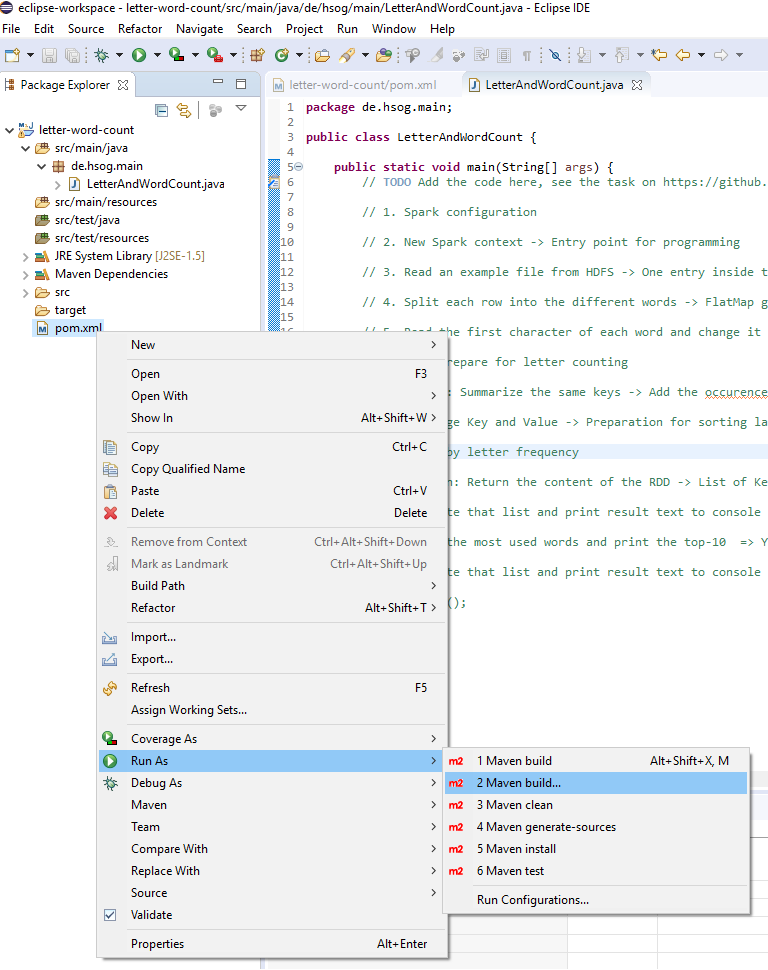
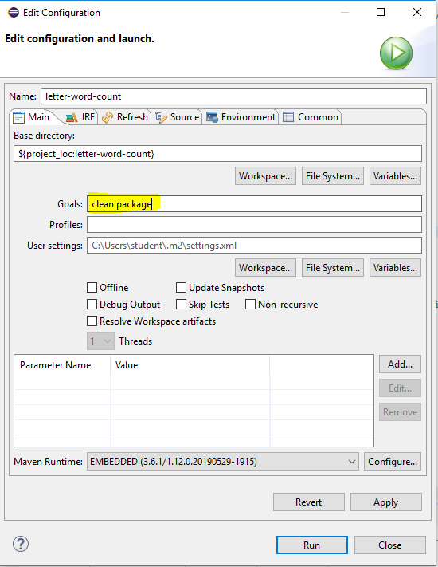
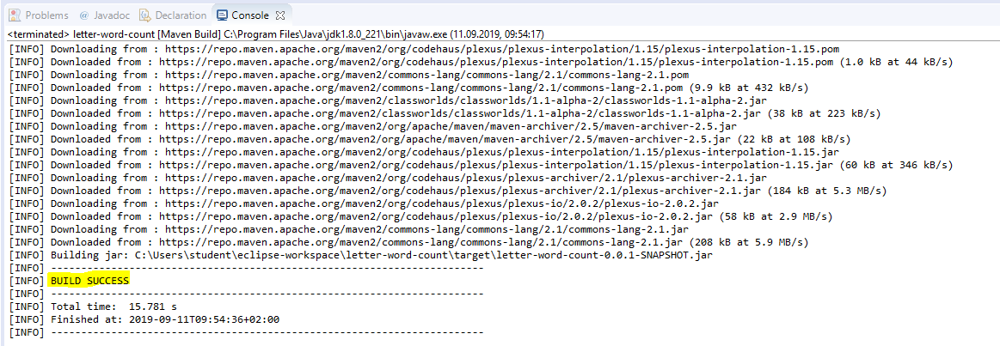
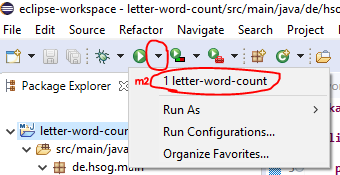

# Analyzing data with Apache Spark (Letter and Word count)

## Preparation

Apache Spark is one of the most famous processing engines in the Apache Hadoop ecosystem. Spark uses in-memory computing to allow fast and distributed data processing across a cluster. It can be installed as stand-alone service or even on a single-node machine for data. Spark contains multiple sub-components for different tasks, e.g. Spark-Streaming for analyzing streaming data, Spark-SQL for working with structured datasets, Spark-MLlib for Machine Learning, etc.

Today, we want to use the RDD-based Spark API for implementing a word-count example. The RDD (Resilient Distributed Datasets) is an abstraction model, which allows the user to define **transformations** (create/load and change data) and **actions** (getting/saving results). The code is used to define the life-line of the data, which means the way that brings data from form A into form B. Spark uses DAGs (Directed Acyclic Graphs) to represent that way internally. When an action is called, the data processing is triggered. 

Spark works with data partitions coming e.g. from HDFS or local file system. The data is processed in parallel across the cluster with so-called Executor (worker) threds. When the data is transformed, the results are collected by the Driver process and then e.g. shown to the user via console outputs.

## Create a Maven project and add dependencies

In this example, we will create a Maven-based Java project to implement a Word-Count application, processed by Spark.

**Hint:** We already created this project in the Eclipse IDE, installed on the VM we use for the workshop. You only have to open Eclipse and then you're ready to add code to the `LetterAndWordCount` class (see next section).

<details>
     <summary>Click to see the steps (not needed in the workshop)</summary>

1. Set up a new Maven project and add the Spark dependencies to the *pom.xml* file  
**Hint:** Since we only use the (core) RDD API, we only need to add the core libraries of Spark:  
```
<dependency>
  <groupId>org.apache.spark</groupId>
  <artifactId>spark-core_2.11</artifactId>    <!--   spark-<component>_<scala-version>   -->
  <version>2.3.2</version>                    <!--   <spark-version>   -->
</dependency>
```
**Hint:** Other libraries (e.g. for SparkSQL) would look similar (exchange *core* by *sql*):  
```
<dependency>
  <groupId>org.apache.spark</groupId>
  <artifactId>spark-sql_2.11</artifactId>     <!--   spark-<component>_<scala-version>   -->
  <version>2.3.2</version>                    <!--   <spark-version>   -->
</dependency>
```

2. Add a class `LetterAndWordCount` with `main` method to your project
```java
public class LetterAndWordCount {
  public static void main(String[] args) {
    // This is the entry point for the Spark logic
  }
}
```

</details>

## Add the Spark code to your class

```java
import java.util.Arrays;
import java.util.List;

import org.apache.spark.SparkConf;
import org.apache.spark.api.java.JavaPairRDD;
import org.apache.spark.api.java.JavaRDD;
import org.apache.spark.api.java.JavaSparkContext;

import scala.Tuple2;

public class LetterAndWordCount {
	public static void main(String[] args) {
		// 1. Spark configuration
		SparkConf conf = new SparkConf();
		conf.setAppName("Spark Letter Count");
		conf.set("spark.executor.memory", "640m");
		conf.set("spark.driver.memory", "640m");

		// 2. New Spark context -> Entry point for programming
		JavaSparkContext jsc = new JavaSparkContext(conf);

		// 3. Read an example file from HDFS -> One entry inside the RDD per row
		JavaRDD<String> inputRDD = jsc.textFile(args[0]);

		// 4. Split each row into the different words -> FlatMap generates one entry inside the RDD per word
		JavaRDD<String> wordsRDD = inputRDD.flatMap(theRow -> {
			String[] wordsInRow = theRow.split("\\W+");
			List<String> wordsList = Arrays.asList(wordsInRow);
			return wordsList.iterator();
		});

		// 5. Read the first character of each word and change it to lower-case letter
		JavaRDD<String> firstCharacterAndLowercaseRDD = wordsRDD.map(theNormalWord -> String.valueOf(theNormalWord.charAt(0)).toLowerCase());

		// 6. Map: Prepare for letter counting
		JavaPairRDD<String, Long> mappedWordsRDD = firstCharacterAndLowercaseRDD.mapToPair(firstCharacterLowercase -> new Tuple2<String, Long>(firstCharacterLowercase, 1L));

		// 7. Reduce: Summarize the same keys -> Add the occurences inside the text
		JavaPairRDD<String, Long> characterCountRDD = mappedWordsRDD.reduceByKey((countA, countB) -> countA + countB);

		// 8. Exchange Key and Value -> Preparation for sorting later
		JavaPairRDD<Long, String> turnedRDD = characterCountRDD.mapToPair(keyValue-> {
			String character = keyValue._1;
			Long count = keyValue._2;
			return new Tuple2<Long, String>(count, character);
		});

		// 9. Order by letter frequency
		JavaPairRDD<Long, String> sortedCharacterCountRDD = turnedRDD.sortByKey();

		// 10. Action: Return the content of the RDD -> List of KeyValue (Tuple2) entries
		List<Tuple2<Long, String>> collectedListOnDriver = sortedCharacterCountRDD.collect();

		// 11. Iterate that list and print result text to console
		for (Tuple2<Long, String> oneEntry : collectedListOnDriver) {
			System.out.println(oneEntry._1 + " words start with the letter " + oneEntry._2);
		}
		
		// 12. Find the most used words and print the top-10 
		// => You can also combine transformations (and the final action call)
		List<Tuple2<Long, String>> topWords = wordsRDD
							.map(oneWord -> oneWord.toLowerCase())
							.mapToPair(oneWord -> new Tuple2<String, Long>(oneWord, 1L))
							.reduceByKey((countA, countB) -> countA + countB)
							.mapToPair(keyValue -> new Tuple2<Long, String>(keyValue._2, keyValue._1))
							.sortByKey(false)
							.take(10);
		
		// 13. Iterate that list and print result text to console
		for(Tuple2<Long, String> topWord : topWords) {
			System.out.println("The word \"" + topWord._2 + "\" occures " + topWord._1 + " times.");
		}
		
		jsc.close();
	}
}
```

## Export the project and put it on the Hadoop node

1. Compile the Java project and export it as JAR file
   * **Hint:** This configuration is already done in the VM you use in the workshop. So this is only for reference, if you want to build another, new Maven project.  
   <details>
     <summary>Click to see the steps (not needed in the workshop)</summary>
   
   * Add run configuration  
   
   * Maven project - Goal `clean package`  
   
   * Click `Apply`
   * Click `Run`
   * You should see an output similar to this  
   
   * When saved and run this configuration once, you can re-use it by clicking the green `Run` button in the top icon menu in Eclipse IDE  
   
     </summary>
     
2. Upload the JAR file to a node of the cluster (HDFS upload not needed)
   * Use FTP client, e.g. FileZilla, WinSCP
   * Upload the JAR file to e.g. */home/studentX/letter-word-count-0.0.1.jar* on NameNode server
   * **Hint:** You find the JAR file inside the *target* directory, which is inside your Eclipse project directory (*C:\Users\student\eclipse-workspace\letter-word-count\target*)

## Run the Spark application

1. Connect via SSH to the server (NameNode of the Hadoop cluster, Port 22, e.g. using PuTTY)
2. Run the *spark-submit* script to start the application:  
`spark-submit --master yarn --deploy-mode client --class <main-class> <path-to-jar> <parameter-args>`  
e.g.  
`spark-submit --master yarn --deploy-mode client --class de.hsog.main.LetterAndWordCount /home/studentX/letter-word-count-0.0.1.jar data/movielens/movies/movies.csv`

**Hint** Spark Jobs can also be implemented and/or triggered using Apache Livy (this is not part of the workshop). More information about Livy here: https://livy.apache.org/
