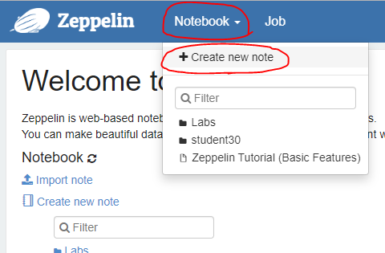
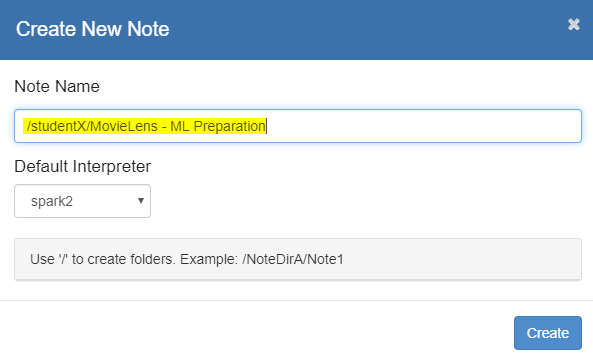

# Using Apache Spark in Zeppelin for preparing the MovieLens data

## About Apache Zeppelin

Apache Zeppelin comes with a web-based UI, where the user can code in notebooks. Some interpreters like `%sh` (shell), `%md` (markdown), `%spark` (Apache Spark) and `%jdbc` (JDBC connection, e.g. to Apache Hive) are pre-installed and can be used directly in new notebooks and enable to interact with Apache Hadoop components to analyse data.

In the workshop, we will analyse the MovieLens dataset using Apache Spark. The file you have to use should be in your HDFS user directory:  
* `/user/studentX/data/movielens/movies`
* `/user/studentX/data/movielens/tags`
* `/user/studentX/data/movielens/ratings`

Since you will use Apache Spark to process the data, you have to add the corresponding interpreter by addind a `%spark` at the beginning of each notebook paragrah. This makes the **SparkContext** `sc` and **SQLContext** `sqlContext` variables available, that are directly linked with a Spark session. The code written in the Zeppelin notebook is executed inside this session.

**Hint:** You could also use **spark-shell** or create a **Scala/Java project** in an IDE of your choise, to do this task. You could use the same commands there to get the same result.

## The task

For ML analysis later, we need to create a dataset of the following form:
```
+-------+-----------------------+------------------------------+------------------------------+------------------+------------+
|movieId|title                  |genres                        |tags                          |rating            |rating_count|
+-------+-----------------------+------------------------------+------------------------------+------------------+------------+
|1      |Toy Story (1995)       |Adventure|Animation|Children|C|friendship|toys come to life|c|3.8866494325899312|68469       |
|2      |Jumanji (1995)         |Adventure|Children|Fantasy    |adapted from book|filmed in bc|3.246582912721512 |27143       |
|3      |Grumpier Old Men (1995)|Comedy|Romance                |old|comedinha de velhinhos eng|3.173981392364453 |15585       |
+-------+-----------------------+------------------------------+------------------------------+------------------+------------+
```

Normally, we have the following 3 options to read the MovieLens data into Spark:

* Using Spark Core + RDD API
  * used in task 3
* Using Spark SQL (Dataset API) + Hive
  * Since we don't have the LLAP (Low-Latency Analytical Processing) functions enabled, we can't use this way here
* Using Spark SQL (Dataset API) + HDFS
  * This is what we'll do now
  
So, we'll use Spark SQL with it's Dataset API and the direct HDFS access, to read in the data in a SQL-like form by using `sqlContext.read` method. We can then use the Dataset API to run transformations, that are inspired by SQL commands, e.g. using *groupBy*, *agg*, *join* calls.

**Hint:** The `df.show(...)` calls are optional, but they can help to understand the transformation, as they show the content of a dataset.

## Preparation

Create a new Zeppelin notebook:  
  
afterwards  


## 1. Reading the Movies data into Dataset

1.1) Read Movies into Dataset
```scala
val dfMoviesA = sqlContext.read.option("header","true").csv("data/movielens/movies")
dfMoviesA.show(3, false)
```

## 2. Read Tags data into Dataset

2.1) Read Tags into Dataset

```scala
val dfTagsA = sqlContext.read.option("header","true").csv("data/movielens/tags")
dfTagsA.show(3, false)
```

2.2) Group the data by *movieId*, because we want to get a list of tags for every movie (1 row per movie)
```scala
val dfTagsB = dfTagsA.groupBy("movieId")
```

2.3) Aggregate the grouped dataset by collecting the *tag* values to a set (without duplicates)
```scala
val dfTagsC = dfTagsB.agg(collect_set(lower($"tag")) as "tags")
dfTagsC.show(3, false)
```

2.4) Transform the set back to a String column, separated by *|*
```scala
val dfTagsD = dfTagsC.withColumn("tags", concat_ws("|", $"tags"))
dfTagsD.show(3, false)
```

2.5) Rename column *movieId* to *movieId_tags*
```scala
val dfTagsE = dfTagsD.withColumnRenamed("movieId", "movieId_tags")
dfTagsE.show(3, false)
```

2.6) Remove special characters, only leave letters, numbers and the split character "|" in the tags column -> replace these characters with spaces
```scala
val dfTagsF = dfTagsE.withColumn("tags", regexp_replace($"tags", "[^A-Za-z0-9|\\s]+", " "))
dfTagsF.show(3, false)
```

2.7) Remove multiple spaces (e.g. added in the last step)
```scala
val dfTagsG = dfTagsF.withColumn("tags", regexp_replace($"tags", "[\\s]+", " "))
dfTagsG.show(3, false)
```

## 3. Read the Ratings data into Dataset

3.1) Read Ratings into Dataset
```scala
val dfRatingsA = sqlContext.read.option("header","true").csv("data/movielens/ratings")
dfRatingsA.show(3, false)
```

3.2) Group the data by *movieId*, because we want to get a average rating per movie
```scala
val dfRatingsB = dfRatingsA.groupBy("movieId")
```

3.3) Aggregate the grouped dataset by calculating average *rating* value per movie
```scala
val dfRatingsC = dfRatingsB.agg(avg($"rating") as "rating", org.apache.spark.sql.functions.count($"rating") as "rating_count")
dfRatingsC.show(3, false)
```

3.4) Rename column *movieId* to *movieId_ratings*
```scala
val dfRatingsD = dfRatingsC.withColumnRenamed("movieId", "movieId_ratings")
dfRatingsD.show(3, false)
```

## 4. Joining the Datasets

4.1) Joining the Movie (+ genres) dataset with the Tags dataset
```scala
val dfJoinA = dfMoviesA.join(dfTagsG, $"movieId" === $"movieId_tags", "left")
dfJoinA.show(3, true)
```

4.2) Remove the *movieId_tags* column
```scala
val dfJoinB = dfJoinA.drop("movieId_tags")
dfJoinB.show(3, true)
```

4.3) Joining the Movie-Tags dataset (joined in step A) with the Ratings dataset
```scala
val dfJoinC = dfJoinB.join(dfRatingsD, $"movieId" === $"movieId_ratings", "left")
dfJoinC.show(3, true)
```

4.4) Remove the *movieId_ratings* column
```scala
val dfJoinD = dfJoinC.drop("movieId_ratings")
dfJoinD.show(3, true)
```

## 5. Save the final Dataset to HDFS

5.1) Save the final dataset to CSV file into HDFS  
**Hint:** The `coalesce(1)` call combines all data into 1 partition, which leads to one written file in HDFS (instead of n files, when running on n partitions). The coalesce call can be dangerous on big datasets, as all data is transfered to one (huge) partition, which can overload a single worker process.
```scala
dfJoinD.coalesce(1).write.mode("overwrite").option("compression", "none").csv("data/movielens_prepared")
```

5.2) Check that file is existing, using another SSH session terminal (this should show a file inside the *movielens_prepared* directory  
```
hdfs dfs -ls data/movielens_prepared
```
