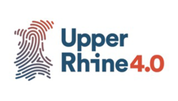

# Summer School 2019
Repository with Hadoop and ML examples for Summer School Workshop 2019

Europäischer Fonds für Regionale Entwicklung  

interreg Oberrhein / Rhin Supérieur  

Upper Rhine 4.0  

## Hadoop cluster access
For the workshop we will use two Hadoop clusters. You can login with following credentials:  
* Username = *studentX*
* Password = *StudentX*

Here the most important UI links:

* Links for users with **odd user id** (1, 3, ...)
  * NameNode IP (e.g. for SSH): 213.164.81.211
  * Ambari: http://213.164.81.211:8080
  * YARN Resource Manager UI (old): http://213.164.81.211:8088/cluster
  * YARN Resource Manager UI (new): http://213.164.81.211:8088/ui2
  * Spark History UI: http://213.164.81.211:18081
  * Apache Zeppelin: http://213.164.81.211:9995 
 
* Links for users with **even user id** (2, 4, ...)
  * NameNode IP (e.g. for SSH): bda-job.emi.hs-offenburg.de
  * Ambari: http://bda-job.emi.hs-offenburg.de:8080
  * YARN Resource Manager UI (old): http://bda-job.emi.hs-offenburg.de:8088/cluster
  * YARN Resource Manager UI (new): http://bda-job.emi.hs-offenburg.de:8088/ui2
  * Spark History UI: http://bda-job.emi.hs-offenburg.de:18081
  * Apache Zeppelin: http://bda-job.emi.hs-offenburg.de:9995 

## Workshop datasets
The following datasets were used in the workshop:
* MovieLens dataset (Full dataset): https://grouplens.org/datasets/movielens/latest/
  * Direct download of the 27M dataset: http://files.grouplens.org/datasets/movielens/ml-latest.zip
* WebLog dataset: A log file of a webserver
  
## Workshop tasks
The exercises of the workshop are divided into the different Hadoop tools. 
* Apache Hadoop / HDFS
  * Upload datasets into distributed file system
* Apache Hive
  * Create tables to query the MovieLens dataset later
  * Example HiveQL queries for examining the MovieLens dataset
* Apache Spark
  * Word and letter count example (Spark RDDs)
* Apache Zeppelin (+ Spark)
  * MovieLens preparation for ML (Spark SQL)
  * Weblog analysis (Spark RDDs)
